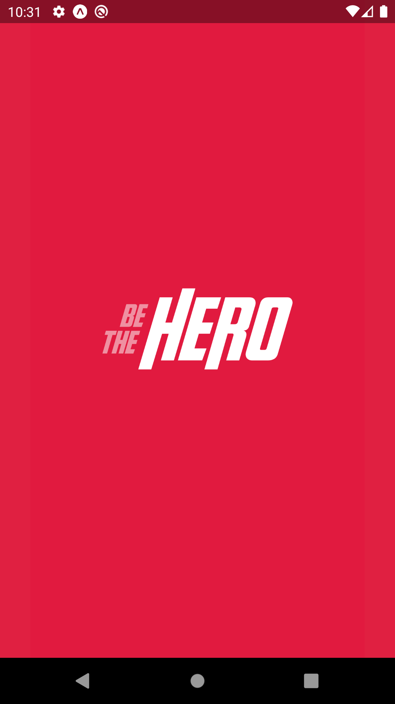

[![LinkedIn][linkedin-shield]][linkedin-url]


<!-- PROJECT LOGO -->
<br />
<p align="center">
  <a href="hhttps://github.com/renata-ps-santos/be-the-hero">
    
  </a>

  <h3 align="center">Projeto criado pela Rocketseat</h3>

  <p align="center">
    <br />
    <a href="https://github.com/renata-ps-santos/be-the-hero"><strong>Explore a documentação »</strong></a>
    <br />
    <br />
    <a href="https://github.com/renata-ps-santos/be-the-hero/issues">Reporte Bug</a>
  </p>
</p>


<!-- TABLE OF CONTENTS -->
## Conteúdo

* [Sobre o Projeto](#sobre-o-projeto)
  * [Tecnologias utilizadas](#tecnologias-utilizadas)
  * [Instalação](#instalação)
* [Uso](#uso)
* [Contribuição](#contribuição)
* [License](#license)
* [Contato](#contato)


<!-- SOBRE O PROJETO -->
## Sobre o Projeto

![Be the Hero início][product-screenshot]

Esse projeto foi desenvolvido pela Rocketseat, com o propósito de ensinar programação com tecnologias famosas como Reactjs e Nodejs
O objetivo foi desenvolver uma aplicação completa para conectar ONGs com pessoas disponíveis a ajudar com auxílio financeiro para que as instituições consigam dar continuidade nos tratamentos de animais encontrados na rua.

Na aplicação - Cliente: ONG
É possível fazer:

* Cadastro da ONG
* Cadastro dos casos
* Listagem dos casos
* Exclusão dos casos

Na aplicação - Cliente: Herói
Android - iOS
É possível fazer:

* Listagem dos casos
* Detalhar caso e ONG
* Entrar em contato com a ONG via WhatsApp ou E-mail

### Tecnologias utilizadas

* [Reactjs](https://pt-br.reactjs.org/)
* [Nodejs](https://nodejs.org/en/)
* [React Native](https://reactnative.dev/)
* [Knex](http://knexjs.org/)
* [SQLite](https://www.sqlite.org/index.html)
* [Expo](https://expo.io/)
* [Express](https://expressjs.com/pt-br/)


### Instalação

2. Clone o repo
```sh
git clone https://github.com/renata-ps-santos/be-the-hero.git
```
3. Instale pacotes NPM
```sh
npm install
```

<!-- USO -->
## Uso

Tela de início - Cliente: ONGs - Aplicação WEB

O logon é feito através de um id gerado pelo Backend com a **biblioteca Crypto** após a chamada da API de criação de ONG e validação dos dados enviados com a **biblioteca Celebrate**.


Tela de perfil da ONG

É onde é feito a listagem, inserção e exclusão de **Casos** específicos da ONG logada


Cliente: Herói - Aplicação React Native com Expo

 


<!-- CONTRIBUIÇÃO -->
## Contribuição

A contribuição é o que torna a comunidade open source um lugar incrível para aprender, inspirar e criar. Qualquer contribuiçao que você faz é **muito apreciado**!

1. Fork o Projeto
2. Crie uma Branch (`git checkout -b feature/AmazingFeature`)
3. Commit suas Mudanças (`git commit -m 'Add some AmazingFeature'`)
4. Push para a Branch (`git push origin feature/AmazingFeature`)
5. Abra uma Pull Request

<!-- CONTATO -->
## Contato

Link do Projeto: [https://github.com/renata-ps-santos/be-the-hero](https://github.com/renata-ps-santos/be-the-hero)


<!-- MARKDOWN LINKS & IMAGES -->
<!-- https://www.markdownguide.org/basic-syntax/#reference-style-links -->
[linkedin-shield]: https://img.shields.io/badge/-LinkedIn-black.svg?style=flat-square&logo=linkedin&colorB=555
[linkedin-url]: https://linkedin.com/in/renata-psantos
[product-screenshot]: images/inicio.png
[product-screenshot-profile]: images/profile.png
[product-screenshot-iniciando-app]: images/home-app.png
[product-screenshot-profile-app]: images/home-app.png
[product-screenshot-detalhes-app]: images/detalhes-app.png
